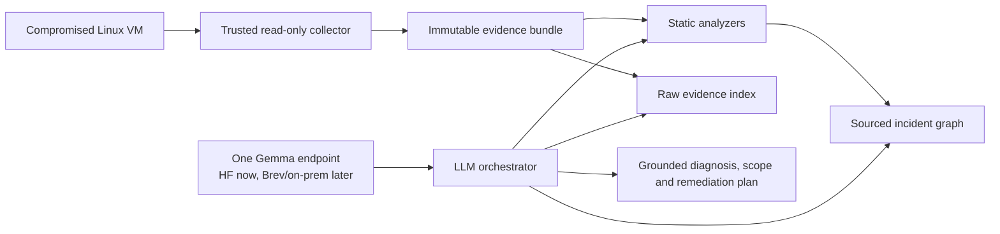

# Gemma incident-response prototype

This project investigates an isolated Linux host with one configured LLM
endpoint. The forensic workflow is independent from the inference deployment:
today the endpoint can be hosted on Hugging Face; the same OpenAI-compatible
contract can later point to Brev, vLLM, or an on-premise NVIDIA appliance.

Real hospital or incident evidence must never be uploaded to a development
endpoint. Cloud GPUs are only for synthetic hackathon cases. The intended
deployment runs the same workflow and model inside the organization's trust
boundary.

## What the prototype does

1. A trusted collector acquires evidence from the isolated victim in read-only
   mode.
2. The application verifies SHA-256 provenance and normalizes Linux events.
3. Static analyzers build candidate facts, IOCs, ATT&CK mappings and a sourced
   incident graph.
4. Gemma starts the investigation and chooses among 16 typed, read-only tools.
5. It reads raw logs and collected system state, tests the candidate attack
   path, determines the observable scope, assesses exfiltration and proposes
   remediation.
6. The application validates citations and safety invariants before accepting
   the LLM report.

There is no smaller-model or deterministic diagnosis fallback. If the
configured model endpoint fails, exhausts its tool budget or returns an
ungrounded report, the investigation fails explicitly. Static outputs remain
available as forensic facts, but are never presented as Gemma's diagnosis.

The reproducible lab covers three distinct incident families:

- SSH account compromise with privileged persistence and blocked exfiltration;
- ransomware impact with service stop, recovery inhibition and encryption;
- public PACS exploitation with a webshell, `sudo` escalation, cron persistence
  and externally corroborated exfiltration.



## Forensic tools available to Gemma

Evidence access:

- `get_case_overview`
- `list_artifacts`
- `search_raw_evidence`
- `get_evidence_context`
- `get_evidence`

Classic host investigation:

- `query_system_state`
- `search_events`
- `get_entity`
- `trace_attack_path`
- `list_iocs`
- `map_attack_techniques`
- `inspect_policy_alerts`

Decision support:

- `assess_exfiltration`
- `assess_incident_scope`
- `get_remediation_constraints`
- `check_action_policy`

The tools expose collected processes, sockets, routes, accounts, logins,
services, cron/systemd persistence, audit logs and package inventory.
They cannot execute a shell, modify the victim or delete evidence. Every excerpt
returned to the model is labeled as untrusted evidence.

Gemma cannot finish before it has covered case integrity, raw evidence,
attack-path reconstruction, scope, exfiltration and remediation constraints.
Material conclusions must cite stable evidence IDs. A claim of confirmed
exfiltration is rejected unless external telemetry supports it.

See [the architecture document](docs/ARCHITECTURE.md) for the complete tool and
trust contract.

## Run the analysis

Create the deterministic graph and dashboard:

```bash
uv sync
uv run gemma-ir analyze eval/fixtures/hospital-demo \
  --output-dir artifacts/demo
```

Configure exactly one OpenAI-compatible model endpoint:

```bash
export MODEL_API_BASE="https://your-endpoint.example/v1"
export MODEL_NAME="your-served-gemma-model"
export MODEL_API_KEY="..."
```

Run the complete static and LLM-orchestrated investigation:

```bash
uv run gemma-ir investigate eval/fixtures/hospital-demo \
  --output-dir artifacts/investigation
```

Endpoint-specific request options can be passed without coupling the workflow to
a runtime:

```bash
uv run gemma-ir investigate eval/fixtures/hospital-demo \
  --extra-body '{"chat_template_kwargs":{"enable_thinking":false}}'
```

`gemma-ir plan` remains available when only the LLM report is needed.

Do not commit API keys. `.env` is ignored, but exporting the variables in the
current shell or using a local secret manager is preferable.

## Inspect or serve a case

Call one tool directly:

```bash
uv run gemma-ir tool eval/fixtures/hospital-demo search_raw_evidence \
  --arguments '{"terms":["backup-admin"],"limit":10}'
```

Build the graph and optionally mirror it to the isolated Neo4j instance:

```bash
./scripts/run-demo.sh
./scripts/run-demo.sh eval/fixtures/hospital-demo --serve
```

The dashboard is served at `http://127.0.0.1:8080`. Generated graph, report,
SVG and HTML files live under `artifacts/demo/`. JSON is the canonical graph
format; Neo4j is an optional read model for exploration, not an inference
fallback.

## Current validation

The deterministic chain was replayed against evidence collected from the Ubuntu
24.04 ARM64 UTM victim. It completed in 0.73 seconds with:

- verified archive integrity;
- 8 candidate attack steps;
- all 6 expected ATT&CK techniques;
- all 6 required IOCs;
- 31 graph nodes and 49 edges;
- one detected prompt-injection attempt in a log.

The real evidence bundle contains 28 collected artifacts and 10,787 searchable
lines. The exfiltration tool classifies the observed transfer as
`attempted_and_blocked` and explicitly records that the absence of firewall,
proxy, Zeek or NetFlow telemetry prevents proving the complete data scope.

On 2026-07-25 the endpoint-driven workflow completed against the same real-VM
archive with Gemma 4 31B QAT, vLLM and one-token MTP on a Hugging Face L40S:

- 21 model-selected tool calls and 9 valid evidence citations;
- 6/6 required IOCs recovered;
- 5/6 expected ATT&CK techniques recovered (`T1552.001` was omitted);
- correct `attempted_and_blocked` exfiltration classification;
- explicit detection of the prompt-injection evidence;
- human approval preserved on all five modifying remediation proposals.

The accepted report is stored at
`artifacts/hf-real-vm/llm-investigation.json`. It also exposes useful prototype
limitations: the scope wording does not emphasize the absence of external
telemetry enough, and the remediation plan should place forensic preservation
before deleting the staged archive.

For the hackathon demonstration, the ransomware run has an auditable execution
view at `artifacts/hf-ransomware-real/llm-execution.html`: it shows the six
investigation rounds, all model-selected tools, the grounded verdict and the
human-approval boundary. See
[`docs/GEMMA-EXECUTION-DEMO.md`](docs/GEMMA-EXECUTION-DEMO.md) for the diagram
and a short presentation script.

`artifacts/hf-ransomware-real/terminal-replay.html` provides the step-by-step
version: one click starts an automatic six-stage sequence on an SSH terminal
connected to the analysis appliance. It shows shell-equivalent forensic
operations and only the results that advance the diagnosis. Those results are
regenerated from the matching local evidence bundle rather than invented for
the UI.

The 32,768-token endpoint measured a 72,970-token GPU KV-cache capacity, or
2.23 concurrent maximum-length requests. A 65,536-token single-investigation
profile is therefore feasible on the same L40S; 128k is not with this exact
model and memory configuration. Observed generation was approximately
43–46 tokens/s, with MTP acceptance generally between 90% and 98%. GPU memory
settled around 42.4/45.5 GB.

Run the complete static and optional LLM benchmark:

```bash
uv run python scripts/benchmark-ir-pipeline.py
uv run python scripts/benchmark-ir-pipeline.py \
  --base-url "$MODEL_API_BASE" \
  --model "$MODEL_NAME" \
  --api-key "$MODEL_API_KEY"
```

Historical E4B-versus-31B and NVIDIA throughput measurements are retained in
[`eval/RESULTS.md`](eval/RESULTS.md), clearly separated from validation of the
current orchestrator.

## DGX Spark deployment

**Measured on a physical DGX Spark on 2026-07-25**, not extrapolated. GB10 Grace
Blackwell (`sm_121`), 121.7 GB unified memory, arm64, Ubuntu 24.04, driver
580.126.09, `vllm/vllm-openai:gemma4-cu130` (multi-arch, `linux/arm64` manifest
confirmed), `--max-model-len 8192`, `--gpu-memory-utilization 0.60`,
concurrency 1.

| Machine | Model | Precision | Suite score | Critical | Decode |
| --- | --- | --- | ---: | ---: | ---: |
| MacBook, Ollama | Gemma 4 E4B | Q4_K_M | 54/87 (62.1%) | 3/11 | 24.4 tok/s |
| L40S, vLLM | Gemma 4 31B | W4A16 | 75/87 (86.2%) | 9/11 | 35.4 tok/s |
| DGX Spark, vLLM | Gemma 4 31B | W4A16 | 76/87 (87.4%) | 9/11 | 11.3 tok/s |
| **DGX Spark, vLLM** | **Gemma 4 26B-A4B** | **bf16** | **79/87 (90.8%)** | **9/11** | 24.0 tok/s |
| DGX Spark, vLLM | Gemma 4 26B-A4B | FP8 online | 76/87 (87.4%) | 8/11 | 38.8 tok/s |

Two results are worth stating plainly. **The on-premise appliance matches the
cloud GPU** — 76/87 against the L40S's 75/87, within run-to-run variation, with no
evidence leaving the building. And **the 26B-A4B MoE beats the 31B dense model on
both axes at once**: 2.1x the decode throughput *and* a higher score, at higher
precision, because the Spark is memory-bandwidth-bound and the MoE reads only its
~4B active parameters per token. Online FP8 adds another 1.6x but costs one
critical check, so bf16 is the shipped configuration.

Batching compounds: the 26B goes from 23.7 to 102.5 tok/s aggregate at
concurrency 8 in bf16, and 176.3 tok/s in FP8, with median TTFT under 0.5 s.

Four configuration failures cost real time and are documented with root causes in
[`eval/SPARK-RESULTS.md`](eval/SPARK-RESULTS.md):

- **`--gpu-memory-utilization 0.80` fails on a busy Spark.** Unified memory is
  shared with every other process on the box; 0.60 is the safe default here.
- **Ollama silently runs on CPU on GB10.** It reports `gpus=1`, starts cleanly,
  then repacks the whole model into host memory. No error. A 31B at 5.66 tok/s.
- **MTP speculative decoding does not load** on this image — the pinned assistant
  uses a `gemma4_assistant` architecture the bundled Transformers does not know.
  The +75% MTP result stands for the L40S only.
- **Third-party quantized MoE checkpoints do not load** either: NVIDIA's NVFP4 and
  RedHatAI's FP8-dynamic both ship per-expert tensors where the loader expects
  Google's fused layout. Use `--quantization fp8` against Google's own bf16
  checkpoint instead.

Raw JSON for every number above is committed under `eval/results/`.

## Hugging Face and NVIDIA development

Hugging Face Jobs can host the 31B checkpoint on an NVIDIA L40S for synthetic
tests. The launch helper defaults to a dry run and does not spend credits:

```bash
./scripts/launch-hf-vllm-job.sh baseline
./scripts/launch-hf-vllm-job.sh mtp
```

After `hf auth login`, add `--launch` only when a paid job is intended. Test any
served endpoint through the same contract:

```bash
./scripts/test-model-api.sh "$MODEL_API_BASE" "$MODEL_NAME"

uv run python scripts/evaluate-ir-quality.py \
  --base-url "$MODEL_API_BASE" \
  --model "$MODEL_NAME" \
  --api-key "$MODEL_API_KEY" \
  --label hf-gemma \
  --output eval/results/quality-hf-gemma.json
```

The previous isolated-throughput experiment measured 35.4 tokens/s for the baseline and
62.1 tokens/s with one-token MTP on the same 31B checkpoint. Those are L40S
measurements, not DGX Spark claims.

The exact model, prompts, tool API and evaluator can be served later on an
on-premise NVIDIA system. The prepared Spark launcher is documented under
[`artifacts/README.md`](artifacts/README.md); no physical Spark throughput has
been measured.

## Victim VM

Use UTM with the Ubuntu Server ARM64 ISO under `artifacts/ubuntu/`. The
preparation notes and lab-only scripts are in [`vm/README.md`](vm/README.md).
The VM team can change the scenario without changing the evidence bundle,
tool-calling or endpoint contracts.
