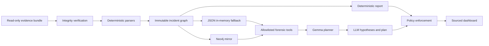

# Gemma IR architecture

## Trust boundaries

The evidence bundle, including log messages and filenames, is always untrusted.
SHA-256 validates evidence integrity; it does not make the contents instructions.

Deterministic observations and LLM hypotheses are separate:

- `observed`: directly supported by a collected line or file;
- `derived`: a deterministic mapping, such as an ATT&CK technique;
- `hypothesis`: reasoning proposed by the LLM and never promoted silently.

The model cannot access a shell, write to the victim, delete evidence, or execute
remediation. Its only callable functions are:

- `search_events`
- `get_evidence`
- `get_entity`
- `trace_attack_path`
- `list_iocs`
- `map_attack_techniques`
- `get_remediation_constraints`
- `check_action_policy`

Any unknown tool name is blocked. `check_action_policy` classifies proposals but
never executes them.

## Fallback order

1. The graph and deterministic report are produced without an LLM.
2. Neo4j is optional; tools use the in-memory graph if it is unavailable.
3. Gemma gets one tool round and one final-answer round.
4. Endpoint failure, timeout, invalid JSON, or a tool loop returns the complete
   deterministic report.
5. Post-processing forces human approval on every modifying action.

## Graph model

Node types are `Host`, `Event`, `Account`, `Group`, `Process`, `Service`, `File`,
`Endpoint`, `Technique`, and `Finding`. Every event contains evidence IDs, and
every evidence reference contains its source path, line number, excerpt, and
source-file SHA-256.

Neo4j is a disposable read model. The evidence bundle remains the source of
truth.
