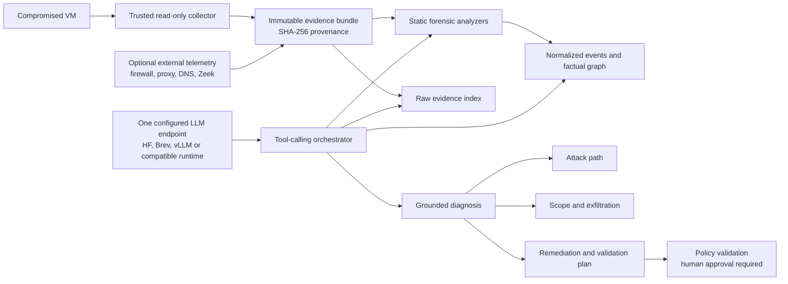

# Endpoint-driven incident-response architecture

## Responsibility split

Static components establish reproducible facts:

- evidence integrity and provenance;
- collected process, socket, account, persistence, audit and package state;
- normalized events, candidate IOCs and ATT&CK mappings;
- literal search and bounded context reads over every collected line;
- conservative host-only scope and exfiltration assessments.

The configured LLM is the investigation orchestrator. It chooses tool arguments,
reads results, challenges candidate detections, correlates evidence, identifies
unknowns, assesses scope and proposes remediation. Static findings are leads,
not a prewritten answer supplied to the model.

There is one model endpoint per run. The application depends only on an
OpenAI-compatible chat-completions interface with function calling. The endpoint
can be hosted on Hugging Face during development and replaced by Brev or an
on-premise NVIDIA runtime without changing the forensic workflow.

## Investigation protocol

The orchestrator cannot return a final report until it has successfully covered:

1. case overview and evidence integrity;
2. raw evidence or collected system-state inspection;
3. evidence-trust and policy-alert inspection;
4. candidate attack-path reconstruction;
5. incident-scope assessment;
6. exfiltration assessment;
7. remediation constraints.

The model may call additional tools and repeat searches. Invalid JSON or an
ungrounded report is returned to the same model for correction while budget
remains. Endpoint failure or exhaustion is an explicit investigation failure;
the application never labels a static report as an LLM diagnosis.

## Read-only tool surface

Evidence access:

- `get_case_overview`
- `list_artifacts`
- `search_raw_evidence`
- `get_evidence_context`
- `get_evidence`

Classic host analysis:

- `query_system_state` for processes, network, accounts, persistence, audit and
  packages
- `search_events`
- `get_entity`
- `trace_attack_path`
- `list_iocs`
- `map_attack_techniques`
- `inspect_policy_alerts`

Decision support:

- `assess_exfiltration`
- `assess_incident_scope`
- `get_remediation_constraints`
- `check_action_policy`

Unknown tool names and invalid arguments are blocked. No tool provides a shell,
writes to the victim, deletes evidence or executes remediation.

## Trust boundaries

Evidence, filenames, log messages and excerpts are always untrusted. SHA-256
verifies that bytes did not change; it does not make their content instructions.

The graph distinguishes:

- `observed`: directly supported by a collected line or file;
- `derived`: produced by a static analyzer;
- `hypothesis`: proposed by the LLM and never promoted silently.

Every material conclusion must cite known evidence IDs. A model claim of
confirmed exfiltration is rejected unless the deterministic exfiltration tool
also has supporting external telemetry.

## Scope semantics

With one collected host and no network telemetry, the maximum honest scope is
`host_only`. Lateral movement and organization-wide impact remain unknown.

Exfiltration uses these bounded states:

- `not_observed`
- `attempted_and_blocked`
- `possible`
- `confirmed`

`confirmed` requires supporting telemetry such as firewall, proxy, Zeek,
NetFlow or an equivalent external source. Host staging plus a failed connection
does not prove data loss.

## Graph and storage

Node types are `Host`, `Event`, `Account`, `Group`, `Process`, `Service`, `File`,
`Endpoint`, `Technique`, and `Finding`. Evidence references contain source path,
line number, excerpt and source-file SHA-256.

The evidence bundle is the source of truth. JSON is the canonical graph format;
Neo4j is an optional read model for exploration and visualization.
