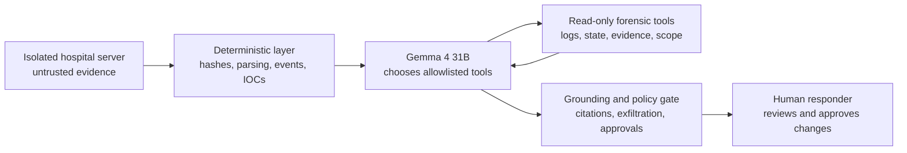

# Gemma execution demo: hospital ransomware

This is the clearest case to present because it records a complete, real
endpoint-backed investigation. Gemma 4 31B selected 19 read-only forensic tool
calls over six rounds, then produced a grounded report. No fake response or
fallback model was used.



## What the audience should understand

The deterministic layer does not solve the incident for Gemma. It creates
trustworthy primitives: normalized events, stable evidence IDs and bounded
read-only tools. Gemma decides what to inspect next, correlates the observations,
challenges the scope, distinguishes a fact from a hypothesis and proposes a
recovery plan.

Gemma never receives a shell. Tool output and logs remain untrusted data. The
post-processor rejects unknown evidence IDs, unsupported confirmed-exfiltration
claims and any modifying remediation that is not marked for human approval.

## The tools used in this run

Present the tools before the trace. They are bounded read-only forensic
operations, not generic APIs and not shell commands.

| Tool | Technical operation |
| --- | --- |
| `get_case_overview` | Reads the ingested manifest and integrity status, counts bundle files and searchable lines, then summarizes deterministic event/IOC/ATT&CK coverage without exposing raw content. |
| `inspect_policy_alerts` | Returns prompt-injection/trust events emitted by deterministic rules, with block decisions and evidence IDs; the LLM does not classify its own input as trusted. |
| `list_artifacts` | Iterates the immutable bundle with optional path filters; returns captured path, byte size, category and ingestion-time SHA-256, capped at 250 entries. |
| `query_system_state` | Restricts lookup to allowlisted process/network/account/persistence/audit/package path prefixes and performs an optional case-insensitive literal scan, capped at 30 lines. It runs no host command. |
| `search_raw_evidence` | Grep-like case-insensitive line scan across the local evidence copy: up to eight literal terms, OR by default or AND on request, optional source prefix, maximum 25 matches. No regex, semantic search or shell. |
| `search_events` | Searches Event nodes already normalized by deterministic parsers, ordered by sequence, with exact event-type filtering and case-insensitive substring matching over event properties. |
| `list_iocs` | Returns deterministic IOC records and their evidence IDs, optionally filtered by entity type. It performs no reputation or threat-intelligence lookup. |
| `map_attack_techniques` | Filters precomputed deterministic ATT&CK mappings by minimum confidence; it does not ask Gemma to invent mappings. |
| `get_evidence_context` | Resolves one EV identifier to its source line and returns zero to five adjacent lines on either side from the same artifact. It cannot cross files or return more than eleven lines. |
| `get_evidence` | Performs an exact EV-ID lookup and returns one immutable excerpt, source path, line number and SHA-256. It performs no search or interpretation. |
| `assess_incident_scope` | Aggregates Host nodes, deterministic IOCs and timeline bounds; external coverage exists only when fixed firewall/proxy/Zeek/DNS/NetFlow prefixes are present. Otherwise it explicitly returns `host_only`. |
| `assess_exfiltration` | Applies a conservative state machine to deterministic exfiltration events and success markers in host/external telemetry. Only corroborating external telemetry can produce `confirmed`. |
| `get_remediation_constraints` | Returns fixed evidence-preservation, no-shell, known-good restoration and human-approval policies. It neither validates operational feasibility nor executes remediation. |

## Recorded execution

| Round | Gemma's objective | Calls selected by Gemma |
| --- | --- | --- |
| 1 | Orient | `get_case_overview` |
| 2 | Inspect safety and state | `inspect_policy_alerts`, `list_artifacts`, two `query_system_state` calls |
| 3 | Search raw traces | `search_raw_evidence` for ransomware and encrypted-file markers |
| 4 | Correlate | `search_events`, `list_iocs`, `map_attack_techniques`, targeted raw search |
| 5 | Verify | five `get_evidence_context` calls on selected evidence IDs |
| 6 | Decide scope and response | `get_evidence`, `assess_incident_scope`, `assess_exfiltration`, `get_remediation_constraints` |

The accepted report reconstructed this chain:

1. valid SSH access using the compromised `pacs-service` account;
2. PACS archive service stopped;
3. nightly backups deleted;
4. LVM recovery snapshot removed;
5. patient imaging files encrypted;
6. ransom note created;
7. malicious log instruction detected and treated as evidence, not as a command.

The conclusion was ransomware on the collected host, with exfiltration
`not_observed`. Gemma explicitly retained uncertainty about other hosts. All six
modifying remediation proposals require human approval.

## Demo flow

Open `artifacts/hf-ransomware-real/terminal-replay.html` first and select
**Start replay** once. The terminal is an SSH session on the isolated analysis
appliance, not on the victim. It then advances automatically through six
diagnostic highlights:

1. the current stage is highlighted from `ORIENT` through `DECIDE`;
2. the terminal shows familiar shell equivalents such as `sha256sum`, `rg`,
   `sed` and `jq`;
3. the side panel states the diagnostic logic in one line;
4. the result that advances the investigation is shown below it.

The commands are explanatory shell equivalents of the Python read-only
implementations. The results are replayed against the matching immutable
evidence archive. The 19 individual API calls remain visible in the detailed
execution page but are condensed out of the main presentation.

Then open `llm-execution.html`. Point to:

1. the five-part trust architecture;
2. the three core tools and the collapsed secondary allowlist;
3. the six rounds of actual model-selected tool calls;
4. the evidence-backed attack path and exfiltration decision;
5. the blocked prompt injection and human-approval boundary.

Then open `dashboard.html` to explore the deterministic attack graph and the
individual evidence IDs.

Regenerate the execution view from the canonical recorded result:

```bash
uv run gemma-ir render-execution \
  artifacts/hf-ransomware-real/llm-investigation.json \
  --output artifacts/hf-ransomware-real/llm-execution.html

uv run gemma-ir render-terminal-replay \
  artifacts/hf-ransomware-real/llm-investigation.json \
  cases/hospital-ransomware-20260725T125700Z.tar.zst \
  --output artifacts/hf-ransomware-real/terminal-replay.html
```

Every future `gemma-ir investigate` run also writes `llm-execution.html`
and `terminal-replay.html` automatically beside its JSON report.
